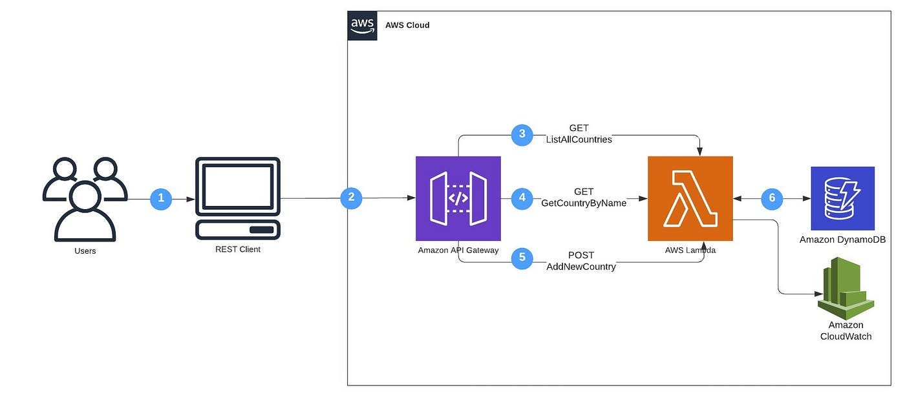

# 🚀 Serverless URL Shortener

A fully serverless URL shortener built using:

- Amazon API Gateway
- AWS Lambda
- Amazon DynamoDB
- Amazon S3
- Amazon CloudFront

## 🧱 Architecture

User → API Gateway → Lambda → DynamoDB  
Frontend → S3 → CloudFront

---

## ⚡ Features

- URL Shortening
- HTTP Redirect
- Click Counter
- TTL Expiry Support
- Fully Serverless
- Low Cost

---

## 🛠 Tech Stack

- Python 3.12
- AWS Lambda
- DynamoDB (On-demand)
- API Gateway (HTTP API)
- S3 Static Hosting
- CloudFront CDN

---

## 🚀 Deployment Steps

1. Create DynamoDB table
2. Deploy Lambda functions
3. Configure API Gateway routes
4. Setup S3 static website
5. Configure CloudFront

---

## 💰 Cost Estimate

₹0 – ₹200 / month (low traffic)

---

## 🎯 Interview Explanation

"I built a fully serverless URL shortener using API Gateway, Lambda, DynamoDB, and S3 with CloudFront including analytics and TTL support."

---

## 👨‍💻 Author

Mahi
